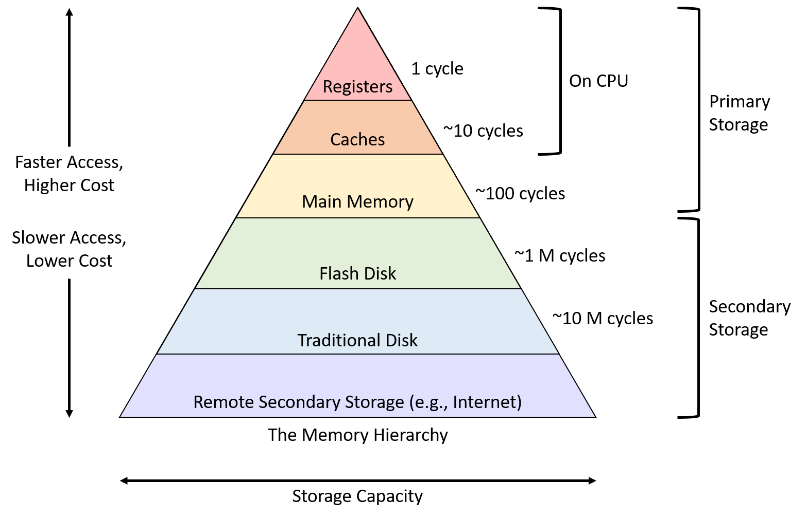
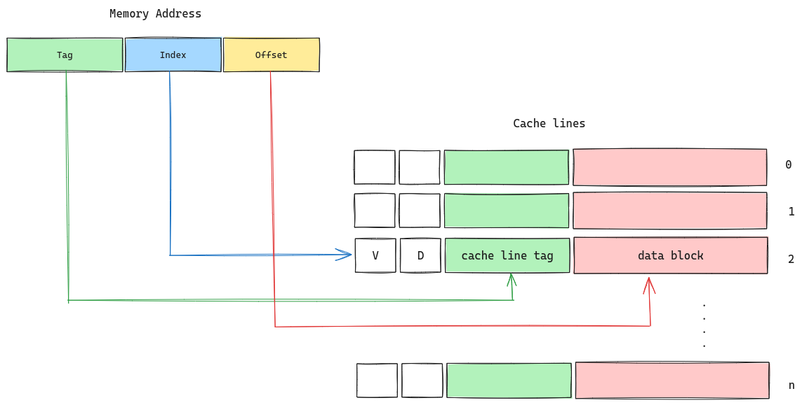

`perf`是`linux`内核提供的一个性能分析工具, 在`linux`的源码中包含了其代码实现. `perf`工具利用一些软件或者硬件的事件对程序的性能进行评估. 这里通过一个缓存失效的例子, 简单介绍如何使用`perf`去定位程序的性能瓶颈.

## 0x01 安装`perf`

`perf`的使用和当前的内核版本是有关联的, 当你的内核版本有一些比较大的更新, 就可能需要安装对应版本的`perf`. 对于`ubuntu`系统, 可以安装软件包:

```shell
$ sudo apt install linux-tools-generic
```

安装完成之后, 执行`"perf list"`可以查看`perf`工具支持的事件类型, 此时可能会提示没有找到当前版本的内核对应的`perf`, 比如:

```shell
$ perf list
WARNING: perf not found for kernel 6.5.0-26

  You may need to install the following packages for this specific kernel:
    linux-tools-6.5.0-26-generic
    linux-cloud-tools-6.5.0-26-generic

  You may also want to install one of the following packages to keep up to date:
    linux-tools-generic
    linux-cloud-tools-generic
```
如果出现类似警告, 按照提示安装对应的软件包就可以解决.

## 0x02 配置`perf`

默认情况下, 普通用户使用`perf`工具, 能使用的功能是受限的, 可以通过修改内核的参数配置, 让非`root`用户也可以正常使用`perf`, 修改之后的配置如下:

```shell
$ sysctl kernel.perf_event_paranoid 
kernel.perf_event_paranoid = -1
$ sysctl kernel.kptr_restrict 
kernel.kptr_restrict = 0
```

关于`perf_event_paranoid`参数的含义如下:


简单来说, 这个参数可以控制非特权用户能够如何使用`perf`工具, 其中`-1`表示几乎全部的`perf_event`对所有用户都可用, 可以根据自己系统的实际情况进行配置, 从文档中可以看出, 用户的`CAP_PERFMON`权能也会影响`perf`工具的使用. 关于其他的内核参数配置, 可以参考`linux`的[官方文档](https://docs.kernel.org/admin-guide/sysctl/kernel.html), 这里可以找到`"/proc/sys/kernel"`目录下其他参数的具体含义.

## 0x03 分析缓存失效问题

### 缓存的硬件设计

在计算机的世界中, 存在着时间和空间上的局部性原理. 对于一个刚刚访问过的内存地址, 很有可能不久之后还会访问, 和这个内存地址相邻的区域也可能马上就会被访问.

为了提升程序的性能, 计算机的存储设备被设计成了一种分层的结构, 如下图所示. 距离CPU越近, 存储器的容量越小, 但访问速度却越快. 缓存存在的意义就在于, 能够保存程序经常访问的数据, 硬件上通过设计合适的策略, 提高缓存的命中率, 减少对内存的访问, 从而让程序的性能得到提升.



在开始分析代码之前, 有必要对缓存的硬件结构进行一些了解. 缓存设计中需要解决的关键问题:

1. 给定一个内存地址, 如何确定它是否在缓存中?
2. 当缓存中的数据和内存中不一致时应该如何处理?
3. 缓存被填满之后, 程序又发起内存访问, 但发生了cache miss, 这时应该按照什么策略去淘汰已经缓存的数据?
4. 多核处理器, 如何维持不同处理器核心的缓存一致性?

在硬件设计上, 缓存的结构可以分为三种:
- Direct-mapped Cache
- Set-associative Cache
- Fully-associative Cache

对软件来说, 缓存是透明的, 这里只介绍`Direct-mapped Cache`, 对于另外两种缓存结构, 基本原理类似, 只是为了提高缓存命中率, 做了一些优化设计.



缓存被分成了若干个`cache line`, 它是缓存能够操作的最小数据单元, 每个`cache line`有一个索引. `cache line`除了在`data block`中保存实际的数据, 还记录了一些元信息. 包括:

- V: `valid`, 表示缓存是否有效;
- D: `dirty`, 表示缓存中的数据是否被写过, 此时缓存中的数据可能和内存是不一致的;
- cache line tag: 用来匹配当前的`cache line`和输入的内存地址;

当程序想要读取内存中的数据时, 需要指定内存地址`addr`, `CPU`会拿到这个地址, 首先去缓存中进行查找:

1. `addr`被划分成了3段, 分别是`Tag`, `Index`和`Offset`;
2. 根据`Index`, 找到对应的`cache line`;

3. `valid`为真:

   - `Tag`匹配, 则根据`Offset`确定要返回`data block`中的哪一部分数据, (cache hit);

   - `Tag`不匹配, 则淘汰当前`cache line`, 并从内存中加载数据到缓存, 更新`cache line`元数据, (cache miss);

4. `valid`为假, 则从内存中加载数据到缓存, 更新`cache line`元数据, (cache miss);

对于向内存写入数据的情况, 也是类似的, 会先尝试写入到缓存中, 并且更新`dirty`标记, 当对应的`cache line`需要被淘汰时, `cache`中的数据才会写入到内存之中, 这种`"lazy"`的处理方式对程序性能提升有明显作用. 关于缓存, 更多内容可以参考:

- [Dive into systems](https://diveintosystems.org/book/C11-MemHierarchy/caching.html#_cpu_caches)
- [ARM64 cache](https://developer.arm.com/documentation/den0024/a/Caches/Cache-terminology)

### 真实的缓存失效问题

- CPU硬件参数

  ```shell
  $ lscpu
  Architecture:            x86_64
    CPU op-mode(s):        32-bit, 64-bit
    Address sizes:         39 bits physical, 48 bits virtual
    Byte Order:            Little Endian
  CPU(s):                  16
    On-line CPU(s) list:   0-15
  Vendor ID:               GenuineIntel
    Model name:            Intel(R) Core(TM) i7-10700F CPU @ 2.90GHz
      CPU family:          6
      Model:               165
      Thread(s) per core:  2
      Core(s) per socket:  8
      Socket(s):           1
  ......
  Caches (sum of all):     
    L1d:                   256 KiB (8 instances)
    L1i:                   256 KiB (8 instances)
    L2:                    2 MiB (8 instances)
    L3:                    16 MiB (1 instance)
  ......
  ```

  这里使用到的`CPU`包含8个硬件`core`, 每个`core`又包含2个逻辑核. 缓存分为3级, 其中`L3 cache`是所有`core`共享的, 每个硬件`core`有自己的`L1`和`L2 cache`, 其中`L1 cache`包含数据缓存和指令缓存两部分. 其中`cache line`的大小均为64字节:
  ```shell
  $ getconf -a | grep LINESIZE
  LEVEL1_ICACHE_LINESIZE             64
  LEVEL1_DCACHE_LINESIZE             64
  LEVEL2_CACHE_LINESIZE              64
  LEVEL3_CACHE_LINESIZE              64
  ```

- 有缓存失效问题的代码

  代码的执行逻辑如下: 完整的实现可以参考[这个仓库](https://github.com/CSL-KU/IsolBench), 其中包含一个`"lantency.c"`文件, 具体的编译过程可以参考仓库中的文档.

  1. 定义一个双向链表结构体, 并且按照`cache line`的大小对齐:

      ```c
      struct item {
      int data;
      int in_use;
      struct list_head list;
      } __attribute__((aligned(CACHE_LINE_SIZE)));;
      ```
  2. 在内存中分配一块区域, 用来保存上述的代码节点. 内存的大小可以通过`"-m"`参数指定, 其中包含的链表节点个数容易计算得到;

  3. 将步骤2得到的所有的链表节点连接起来;
    
      - 如果传递了`"-s"`参数, 则顺序连接链表节点;
      - 否则, 随即连接链表节点;
  
  4. 访问链表全部节点, 其中对链表的访问次数可以通过参数控制;
  
  下面我们使用`perf`工具记录一下程序执行过程中, 不同情况下, 缓存的命中情况. 这里`perf`记录的事件为`LLC-loads`和`LLC-load-misses`, 即最后一级缓存`load`的次数, 和最后一级缓存`load miss`的次数, 程序的实际表现和具体的机器有关, 但大体趋势应该一致.

  - 分配的内存区域小于`L3 cache`的大小:

    因为`L3 cache`大小为`16M`, 这里分配的内存为`8M`, 理论上全部的节点都可以被放到`L3 cache`中, 除了第一次访问链表节点, 之后的访问都可以从缓存中拿到数据, 所以缓存`miss`的次数很少, 只有`0.26%`.

      ```shell
      $ perf stat -e instructions,LLC-loads,LLC-load-misses ./lantency -m 8192
      allocated: wokingsetsize=131072 entries
      initialized.
      duration 161948 us
      average 12.36 ns | bandwidth 5179.82 MB (4939.86 MiB)/s
      readsum  858986905600

      Performance counter stats for './lantency -m 8192':

            104,732,693      instructions                                                          
              13,410,280      LLC-loads                                                             
                  34,923      LLC-load-misses                  #    0.26% of all L1-icache accesses 

            0.167156717 seconds time elapsed

            0.167151000 seconds user
            0.000000000 seconds sys
      ```

  - 分配的内存区域大于`L3 cache`的大小, 并且随机连接内存中的链表节点:

    这次分配的内存为`32M`, 并非所有的链表节点都能保存在缓存中, 而且由于这块内存区域内的链表节点是随即连接的, 访问时不符合空间上的局部性原理, 所以`cache miss`的比例高达`57.20%`.

    ```shell
    $ perf  stat -e instructions,LLC-loads,LLC-load-misses ./lantency -m 32768
    allocated: wokingsetsize=524288 entries
    initialized.
    duration 3096091 us
    average 59.05 ns | bandwidth 1083.77 MB (1033.56 MiB)/s
    readsum  13743869132800

    Performance counter stats for './lantency -m 32768':

          419,439,250      instructions                                                          
            66,792,435      LLC-loads                                                             
            38,203,338      LLC-load-misses                  #   57.20% of all L1-icache accesses 

          3.121675467 seconds time elapsed

          3.109612000 seconds user
          0.012006000 seconds sys
    ```

  - 分配的内存区域大于`L3 cache`的大小, 并且顺序连接内存中的链表节点:

    这次不改变内存区域的大小, 增加一个`"-s"`参数, 让内存区域内的链表节点顺序连接, 访问链表时遵循空间上的局部性原理, 这对于缓存来说是比较友好的, 因此`cache miss`的比例有所减小, 变成了`36.26%`.

    ```shell
    $ perf  stat -e instructions,LLC-loads,LLC-load-misses ./lantency -m 32768 -s
    allocated: wokingsetsize=524288 entries
    initialized.
    duration 281269 us
    average 5.36 ns | bandwidth 11929.65 MB (11377.00 MiB)/s
    readsum  13743869132800

    Performance counter stats for './lantency -m 32768 -s':

          375,276,613      instructions                                                          
            5,734,433      LLC-loads                                                             
            2,079,054      LLC-load-misses                  #   36.26% of all L1-icache accesses 

          0.297869550 seconds time elapsed

          0.285804000 seconds user
          0.012076000 seconds sys
    ```

  除此之外, `perf`工具还可以对程序的执行过程进行记录, 帮助我们分析代码的性能瓶颈在什么地方, 比如:

    ```shell
    $ perf record -e cycles:pp ./lantency -m 32768 # record功能, 会对程序执行过程进行记录
    allocated: wokingsetsize=524288 entries
    initialized.
    duration 3245976 us
    average 61.91 ns | bandwidth 1033.72 MB (985.84 MiB)/s
    readsum  13743869132800
    [ perf record: Woken up 2 times to write data ]
    [ perf record: Captured and wrote 0.521 MB perf.data (13042 samples) ] # 会在当前目录生成perf.data文件
    ```

  接下来就可以使用`"perf report"`去查看程序中的热点代码了, 整体的`overhead`比例如下:

    

  性能问题主要集中在`main`函数中, `perf`工具可以帮我们定位到`main`函数中的热点代码:

    

  从中可以看出, 对链表节点的访问是瓶颈所在, 这是问题的表象, 更深层的原因是链表节点的随机连接, 导致的缓存`miss`比例过高. 以上就是一个使用`perf`工具对程序进行性能分析的简单例子.

## 0x04 总结

1. `perf`基于软件或者硬件的事件评估程序性能;
2. `perf`和`linux`内核版本关联, 更新了内核可能需要对`perf`进行更新;
3. 默认情况非`root`用户使用`perf`有些限制;
4. 说明了缓存的硬件结构和工作原理, 使用`perf`分析了缓存失效问题;
5. 为了提高程序的性能, 在编码过程中可以考虑如何提高缓存命中率;
