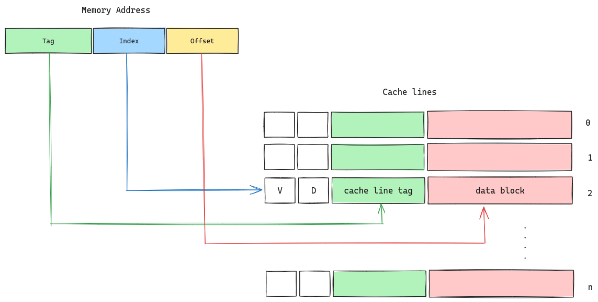

`perf`是`linux`内核提供的一个性能分析工具, 在`linux`的源码中包含了其代码实现. `perf`工具利用一些软件或者硬件的事件对程序的性能进行评估. 这里通过一个缓存失效的例子, 简单介绍如何使用`perf`去定位程序的性能瓶颈.

## 0x01 安装`perf`

`perf`的使用和当前的内核版本是有关联的, 当你的内核版本有一些比较大的更新, 就可能需要安装对应版本的`perf`. 对于`ubuntu`系统, 可以安装软件包:

```shell
$ sudo apt install linux-tools-generic
```

安装完成之后, 执行`"perf list"`可以查看`perf`工具支持的事件类型, 此时可能会提示没有找到当前版本的内核对应的`perf`, 比如:

```shell
$ perf list
WARNING: perf not found for kernel 6.5.0-26

  You may need to install the following packages for this specific kernel:
    linux-tools-6.5.0-26-generic
    linux-cloud-tools-6.5.0-26-generic

  You may also want to install one of the following packages to keep up to date:
    linux-tools-generic
    linux-cloud-tools-generic
```
如果出现类似警告, 按照提示安装对应的软件包就可以解决.

## 0x02 配置`perf`

默认情况下, 普通用户使用`perf`工具, 能使用的功能是受限的, 可以通过修改内核的参数配置, 让非`root`用户也可以正常使用`perf`, 修改之后的配置如下:

```shell
$ sysctl kernel.perf_event_paranoid 
kernel.perf_event_paranoid = -1
$ sysctl kernel.kptr_restrict 
kernel.kptr_restrict = 0
```

关于`perf_event_paranoid`参数的含义如下:


简单来说, 这个参数可以控制非特权用户能够如何使用`perf`工具, 其中`-1`表示几乎全部的`perf_event`对所有用户都可用, 可以根据自己系统的实际情况进行配置, 从文档中可以看出, 用户的`CAP_PERFMON`权能也会影响`perf`工具的使用. 关于其他的内核参数配置, 可以参考`linux`的[官方文档](https://docs.kernel.org/admin-guide/sysctl/kernel.html), 这里可以找到`"/proc/sys/kernel"`目录下其他参数的具体含义.

## 0x03 分析缓存失效问题

### 缓存的硬件设计

在计算机的世界中, 存在着时间和空间上的局部性原理. 对于一个刚刚访问过的内存地址, 很有可能不久之后还会访问, 和这个内存地址相邻的区域也可能马上就会被访问.

为了提升程序的性能, 计算机的存储设备被设计成了一种分层的结构, 如下图所示. 距离CPU越近, 存储器的容量越小, 但访问速度却越快. 缓存存在的意义就在于, 能够保存程序经常访问的数据, 硬件上通过设计合适的策略, 提高缓存的命中率, 减少对内存的访问, 从而让程序的性能得到提升.


在开始分析代码之前, 有必要对缓存的硬件结构进行一些了解. 缓存设计中需要解决的关键问题:

1. 给定一个内存地址, 如何确定它是否在缓存中?
2. 当缓存中的数据和内存中不一致时应该如何处理?
3. 缓存被填满之后, 程序又发起内存访问, 但发生了cache miss, 这时应该按照什么策略去淘汰已经缓存的数据?
4. 多核处理器, 如何维持不同处理器核心的缓存一致性?

在硬件设计上, 缓存的结构可以分为三种:
- Direct-mapped Cache
- Set-associative Cache
- Fully-associative Cache

对软件来说, 缓存是透明的, 这里只介绍`Direct-mapped Cache`, 对于另外两种缓存结构, 基本原理类似, 只是为了提高缓存命中率, 做了一些优化设计.



缓存被分成了若干个`cache line`, 它是缓存能够操作的最小数据单元, 每个`cache line`有一个索引. `cache line`除了在`data block`中保存实际的数据, 还记录了一些元信息. 包括:

- V: `valid`, 表示缓存是否有效;
- D: `dirty`, 表示缓存中的数据是否被写过, 此时缓存中的数据可能和内存是不一致的;
- cache line tag: 用来匹配当前的`cache line`和输入的内存地址;

当程序想要读取内存中的数据时, 需要指定内存地址`addr`, `CPU`会拿到这个地址, 首先去缓存中进行查找:

1. `addr`被划分成了3段, 分别是`Tag`, `Index`和`Offset`;
2. 根据`Index`, 找到对应的`cache line`;

3. `valid`为真:

   2.1. `Tag`匹配, 则根据`Offset`确定要返回`data block`中的哪一部分数据, (cache hit);

   2.2. `Tag`不匹配, 则淘汰当前`cache line`, 并从内存中加载数据到缓存, 更新`cache line`元数据, (cache miss);

4. `valid`为假, 则从内存中加载数据到缓存, 更新`cache line`元数据, (cache miss);

对于向内存写入数据的情况, 也是类似的, 会先尝试写入到缓存中, 并且更新`dirty`标记, 当对应的`cache line`需要被淘汰时, `cache`中的数据才会写入到内存之中, 这种`"lazy"`的处理方式对程序性能提升有明显作用. 关于缓存, 更多内容可以参考:

- [Dive into systems](https://diveintosystems.org/book/C11-MemHierarchy/caching.html#_cpu_caches)
- [ARM64 cache](https://developer.arm.com/documentation/den0024/a/Caches/Cache-terminology)

### 真实的缓存失效问题

待续...

## 0x04 总结

1. `perf`基于软件或者硬件的事件评估程序性能;
2. `perf`和`linux`内核版本关联, 更新了内核可能需要对`perf`进行更新;
3. 默认情况非`root`用户使用`perf`有些限制;
4. 说明了缓存的硬件结构和工作原理, 使用`perf`分析了缓存失效问题;
